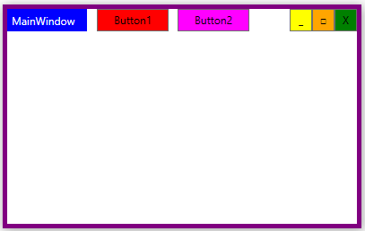

# WPF custom frame example using DWM API and WM_NCHITTEST

WPF provides WindowChrome class to remove standard Windows non-client area and provide custom border and title. Unfortunately, removing all non-client edges with WindowChrome results in some ugly flickering on window resize. To solve this problem, you can use DwmExtendFrameIntoClientArea function to remove standard non-client are and handle WM_NCHITTEST message to process non-client are mouse clicks so your window can be moved and resized. This enables you to remove all edges without flickering.

Based on [Custom Window Frame Using DWM](https://docs.microsoft.com/en-us/windows/win32/dwm/customframe) Microsoft Docs example.
